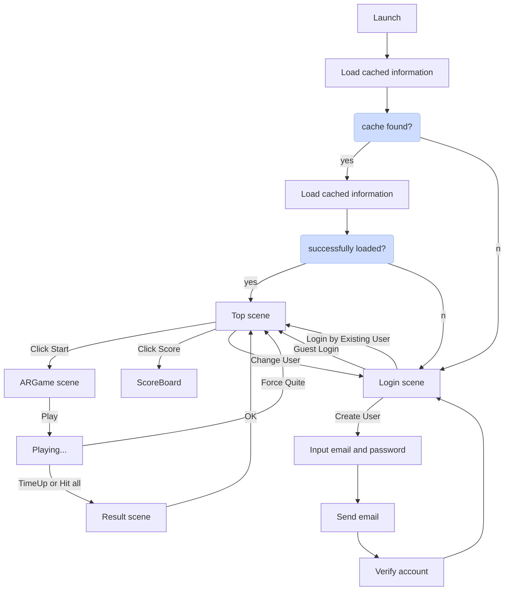

# DESIGN 

This document summarize the source code design specifications.
> **Note:** 
> To see the diagrams written in mermaid format, install Markdown Preview Mermaid Support from extension market places.

## Scenes

Siribal application is established from following scenes

- Top
- Login
- ARGame
- Loading
- Result
- ScoreBoard

Define the behaviour of these states

> **NOTE**
> "Back to Top" button flow is ommitted.

