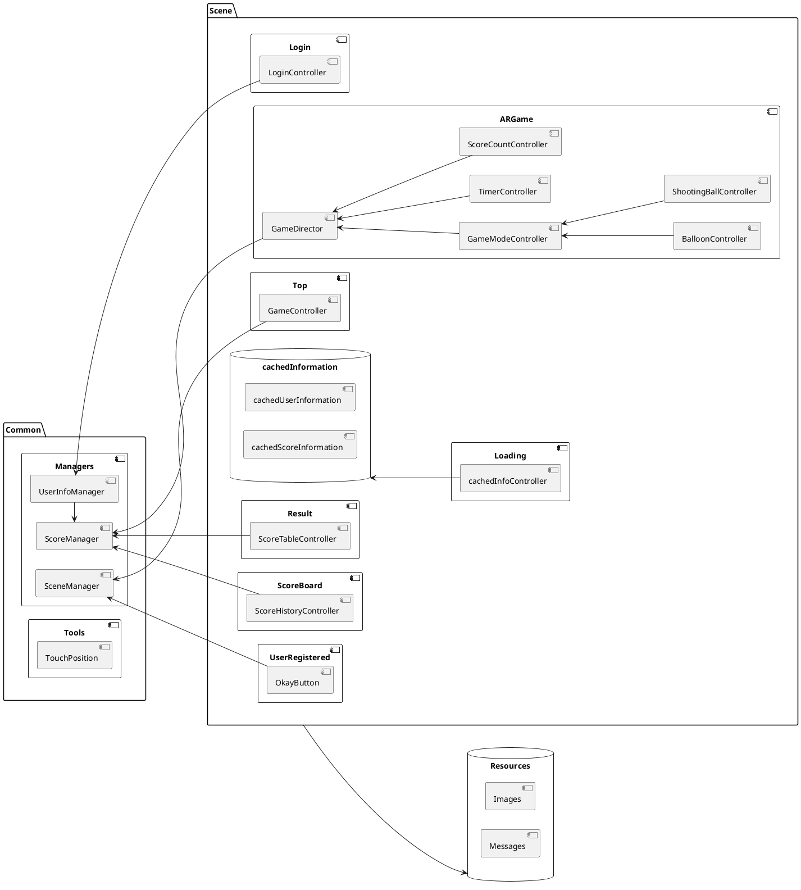

# Script Rule

## Component & IFs

```plantuml
@startuml
left to right direction

Common --[hidden]-- Scene

package Common{
    component Managers{
        component SceneManager
        component UserInfoManager
        component ScoreManager
    }
    UserInfoManager --ri--> ScoreManager
    component Tools{
        component TouchPosition
    }
}

database Resources{
    component Images
    component Messages
}
Scene --do--> Resources

package Scene{
    component Top{
        component GameController
    }
    GameController --le--> SceneManager

    component Login{
        component LoginController
    }
    LoginController --le--> UserInfoManager

    component ARGame{
        component GameDirector
        component BalloonController
        component ShootingBallController
        component GameModeController
        component TimerController
        component ScoreCountController
    }
    BalloonController --up--> GameModeController
    ShootingBallController --up--> GameModeController
    GameModeController --up--> GameDirector
    TimerController --up--> GameDirector
    ScoreCountController --up--> GameDirector
    GameDirector --le--> ScoreManager

    component Loading{
        component cachedInfoController
    }
    cachedInformation <--do-- cachedInfoController
    component Result{
        component ScoreTableController
    }
    ScoreTableController --le--> ScoreManager
    component ScoreBoard{
        component ScoreHistoryController
    }
    ScoreHistoryController --le--> ScoreManager

    component UserRegistered{
        component OkayButton
    }
    OkayButton --le--> SceneManager
}

database cachedInformation{
    component cachedUserInformation
    component cachedScoreInformation
}

@enduml
```